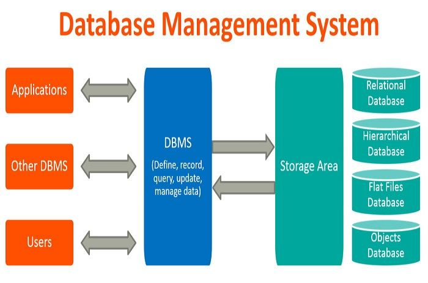
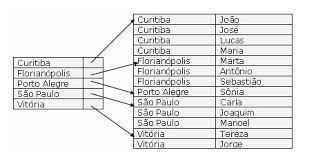

# Índices no Mongo

Projeto para documentar a apresentação sobre índices no Mongo na [Liven](https://liven.tech).

## Introdução

### SGBD

SGBD (Sistema Gerenciador de Banco de Dados), é um software que gerencia um ou mais banco de dados. Ele é responsável por abstrair do cliente as responsabilidades como acesso, persistência, manipulação e organização dos dados. Todo SGBD possui uma interface para facilitar a manipulação e gerenciamento dos dados.

### MongoDB - Atlas

Diferentemente dos SGBDs relacionais (MySQL, Postgres, etc), o Mongo é um banco não relacional orientado a documentos. Traçando um paralelo didático superficial, cada tabela no relacional seria uma coleção no Mongo e cada linha, um documento.

O Mongo possui um DBaaS (Database as a Service) denominado [Atlas](https://www.mongodb.com/atlas/database). Com ele, podemos construir desde clusters compartilhados gratuítos, até clusters dedicados.

### O que são índices?

Índices são estruturas auxiliares associados a uma tabela (no contexto de SGBDs relacionais), ou coleção (no contexto do MongoDB). Essa estrutura, via de regra, permite uma localização mais rápida de um registro quando efetuada uma consulta.

A analogia clássica são índices de livros. Se você deseja ler apenas um capítulo específico, basta consultar no índice remissivo e pular diretamente para a página em questão; não precisa ler o livro inteiro para encontrar o trecho desejado.

[Esse link](http://www.bosontreinamentos.com.br/bancos-de-dados/o-que-sao-indices-em-bancos-de-dados-indexacao-em-tabelas/) tem informações mais detalhadas, explicando um pouco algumas estruturas, como Árvore-B, Bitmap, Hashing, entre outros.

### Prós e contras

// TODO

---

## Setup

1. Criar 1 milhão de usuários na base
1. Criar 500k de pedidos na base apenas para 3 usuários

### Consultando usuário pelo nome

1. Rodar uma consulta pelo nome do usuário - mostrar explain no compass
1. Adicionar índice no nome do usuário
1. Rodar consulta novamente pelo nome do usuário - mostrar explain no compass

### Consultando pedido pelo range de data

1. Rodar uma consulta por um range de data - mostrar explain no compass
1. Adicionar índice na data de compra do pedido
1. Rodar consulta novamente por um range de data - mostrar explain no compass

### Consultando pedido pelo ID do usuário e método de pagamento (composto)

1. Rodar uma consulta por um ID do usuário e método de pagamento - mostrar explain no compass
1. Adicionar índice no ID do usuário e método de pagamento (composto)
1. Rodar consulta novamente por um ID do usuário e método de pagamento - mostrar explain no compass

### BONUS 1: Full text search

1. Quero filtrar usuários que contenham um termo tanto no nome quanto no email
1. Primeira forma de fazer isso seria colocando um $or
1. Forma mais elegante seria usando full text search
1. Criar índice de fulltext
1. Filtrar por "limoni"
1. Mostrar resultado
1. Mostrar explain

### BONUS 2: Configurando índices direto no mongoose

1. Índice no nome do usuário
1. Índice na data do pedido
1. Índice composto - ID do usuário + método de pagamento

---

## Referências

- [SGBD](https://pt.wikipedia.org/wiki/Sistema_de_gerenciamento_de_banco_de_dados)
- [Índice](<https://pt.wikipedia.org/wiki/%C3%8Dndice_(estruturas_de_dados)>)
- [Índice](http://www.bosontreinamentos.com.br/bancos-de-dados/o-que-sao-indices-em-bancos-de-dados-indexacao-em-tabelas/)
- [MongoDB](https://tecnoblog.net/responde/o-que-e-e-para-que-serve-o-mongodb/)
- [Mongoose](https://mongoosejs.com/)
