# Índices no Mongo

Projeto para documentar a apresentação sobre índices no Mongo na [Liven](https://liven.tech).

## Introdução

### SGBD

SGBD (Sistema Gerenciador de Banco de Dados), é um software que gerencia um ou mais bancos de dados. Ele é responsável por abstrair do cliente as responsabilidades como acesso, persistência, manipulação e organização dos dados. Todo SGBD possui uma interface para facilitar a manipulação e gerenciamento dos dados.

### MongoDB + Atlas

Diferentemente dos SGBDs relacionais (MySQL, Postgres, etc), o Mongo é um banco não relacional orientado a documentos. Traçando um paralelo didático superficial, cada tabela no relacional seria uma coleção no Mongo e cada linha, um documento.

O Mongo possui um DBaaS (Database as a Service) denominado [Atlas](https://www.mongodb.com/atlas/database). Com ele, podemos construir desde clusters compartilhados gratuítos até clusters dedicados pagos.

### O que são índices?

Índices são estruturas auxiliares associados a uma tabela (no contexto de SGBDs relacionais), ou coleção (no contexto do MongoDB). Essa estrutura, via de regra, permite uma localização mais rápida de um registro quando efetuada uma consulta.

A analogia clássica são índices de livros. Se você deseja ler apenas um capítulo específico, basta consultar no índice remissivo e pular diretamente para a página em questão; não precisa ler o livro inteiro para encontrar o trecho desejado.

[Esse link](http://www.bosontreinamentos.com.br/bancos-de-dados/o-que-sao-indices-em-bancos-de-dados-indexacao-em-tabelas/) apresenta informações mais detalhadas, explicando um pouco algumas estruturas de índices, como Árvore-B, Bitmap, Hashing, entre outros.

### Tradeoffs

Apesar de poder otimizar bastante as consultas na base de dados, é preciso cautela e uma análise prévia antes de criar índices para todas as propriedades, a fim de garantir que sejam aplicados da melhor maneira.

#### Prós

- Otimização de consultas em muitos casos
- Acesso a dados ordenados rapidamente
- Facilidade em garantir unicidade de valores

#### Contras

- Piora a performance de escrita dos dados
- Aumenta o consumo de espaço de armazenamento
- Aumenta a necessidade de manutenção na base
- Se aplicado erroneamente, pode diminuir a performance das consultas

[Essa resposta no Stackoverflow](https://pt.stackoverflow.com/a/35096) apresenta mais detalhes sobre cada pró e contra e informações mais detalhadas para discernir corretamente os cenários para uso de índices.

---

## Mão na massa

### Base de testes

Foi criada uma base de dados didática com duas coleções: usuários e pedidos. A coleção de usuários possui 1M de documentos, já a de pedidos possui 500k de documentos referenciando três usuários randômicos.

Você pode replicar essa base, confira como na Seção [Reproduzindo a base de dados](#reproduzindo-a-base-de-dados).

### Consultando usuário pelo nome

1. Rodar uma consulta pelo nome do usuário - mostrar explain no compass

   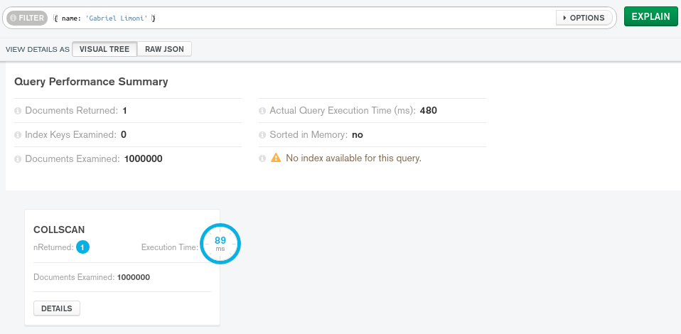

1. Adicionar índice no nome do usuário

   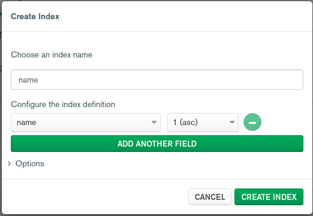

1. Rodar consulta novamente pelo nome do usuário - mostrar explain no compass

   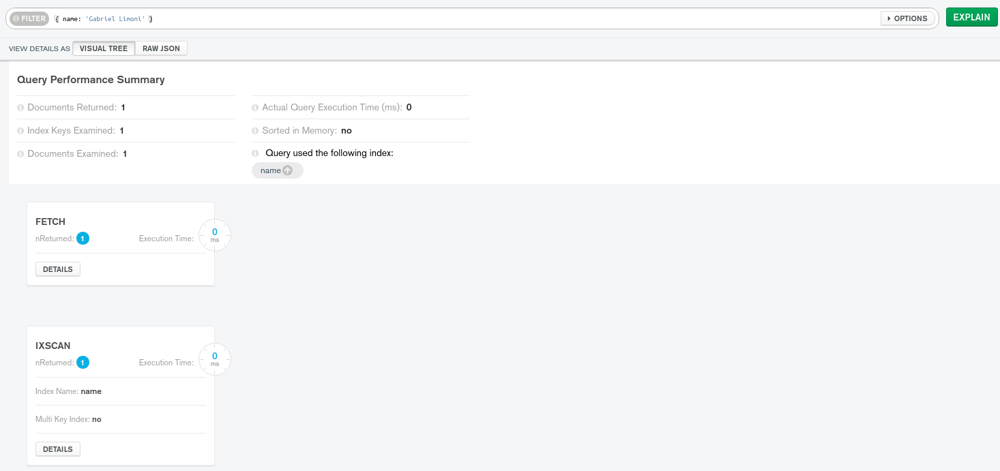

### Consultando pedido pelo range de data

1. Rodar uma consulta por um range de data - mostrar explain no compass

   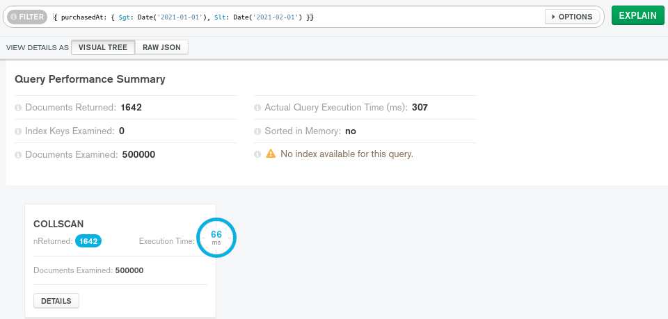

1. Adicionar índice na data de compra do pedido

   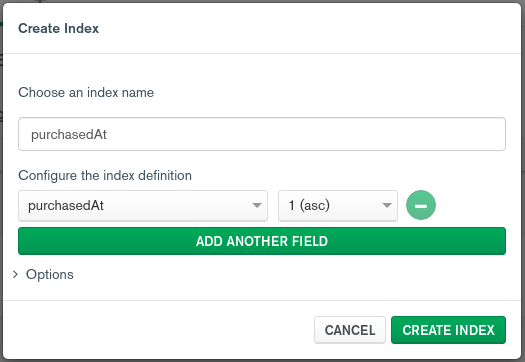

1. Rodar consulta novamente por um range de data - mostrar explain no compass

   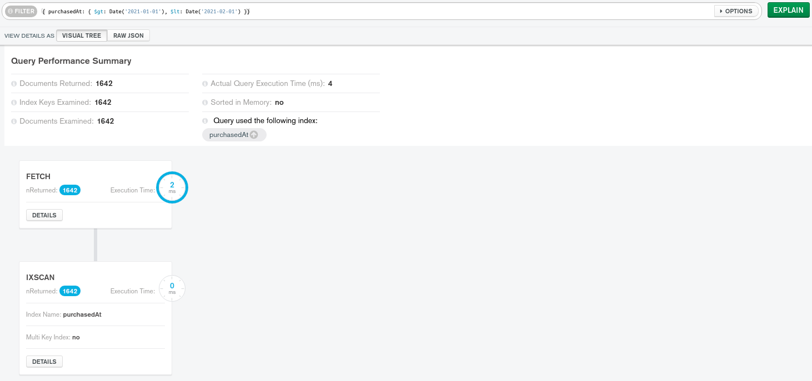

### Consultando pedido pelo ID do usuário e método de pagamento (composto)

1. Rodar uma consulta por um ID do usuário e método de pagamento - mostrar explain no compass

   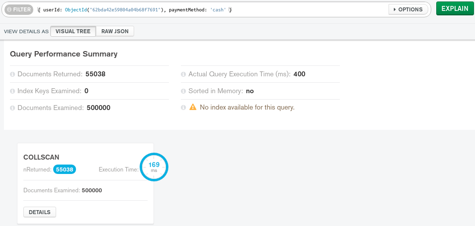

1. Adicionar índice no ID do usuário e método de pagamento (composto)

   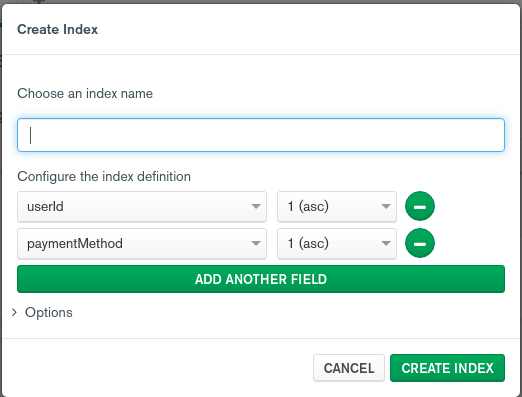

1. Rodar consulta novamente por um ID do usuário e método de pagamento - mostrar explain no compass

   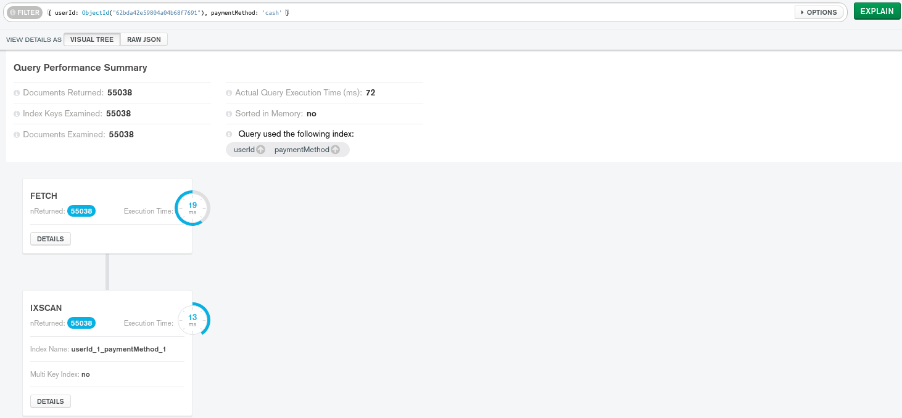

### BONUS 1: Text search

Quero filtrar usuários que contenham um termo tanto no nome quanto no email. Forma mais simples de fazer isso seria colocando um [$or](https://www.mongodb.com/docs/manual/reference/operator/query/or/). Forma mais elegante seria usando [text search](https://www.mongodb.com/docs/manual/text-search/).

1. Criar índice de fulltext

   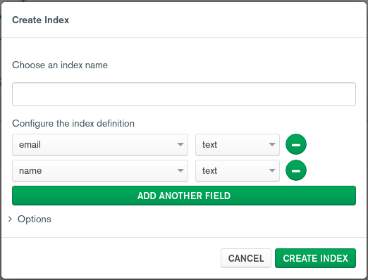

1. Filtrar por "limoni"

   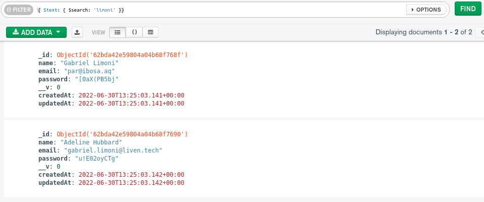

1. Explain da consulta

   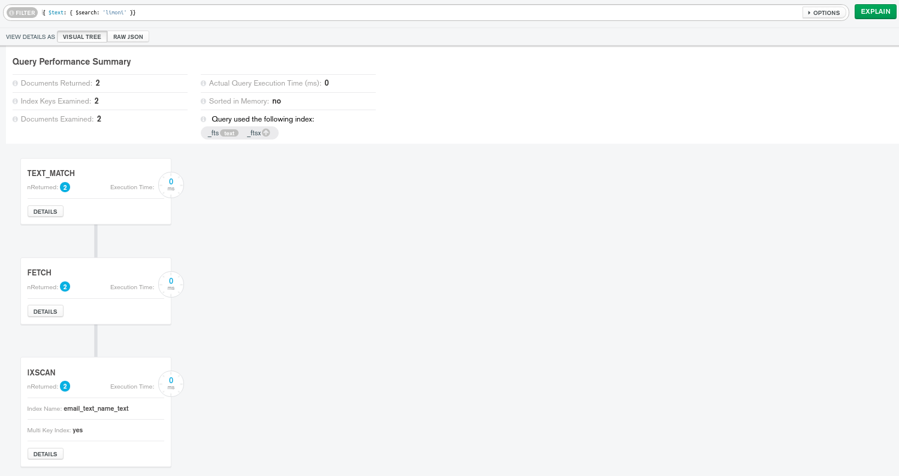

### BONUS 2: Configurando índices direto no mongoose

1. Índice no nome do usuário
1. Índice na data do pedido
1. Índice composto - ID do usuário + método de pagamento

---

## Reproduzindo a base de dados

Para reproduzir a base de dados, primeiramente crie um cluster no [MongoDB Atlas](https://www.mongodb.com/atlas/database) (pode optar por executar localmente se preferir) e obtenha a string de conexão.

Com o acesso ao banco, crie um arquivo `.env` na raiz do projeto com o mesmo conteúdo do `.env.example`, colocando a string de conexão obtida.

Execute os comandos:

1. `npm install`
1. `npm run setup:create-users` para criar 1M de usuários na base;
1. `setup:create-orders` para criar 500k de pedidos para 3 usuários randomicos na base
1. (opcional) Instale e configure a conexão utilizando o [Compass](https://www.mongodb.com/products/compass)
1. (opcional) Altere os dados dos registros como preferir para fazer os seus testes

---

## Referências

- [SGBD](https://pt.wikipedia.org/wiki/Sistema_de_gerenciamento_de_banco_de_dados)
- [Índice](<https://pt.wikipedia.org/wiki/%C3%8Dndice_(estruturas_de_dados)>)
- [Índice](http://www.bosontreinamentos.com.br/bancos-de-dados/o-que-sao-indices-em-bancos-de-dados-indexacao-em-tabelas/)
- [MongoDB](https://tecnoblog.net/responde/o-que-e-e-para-que-serve-o-mongodb/)
- [Mongoose](https://mongoosejs.com/)
- [Prós e contras](https://pt.stackoverflow.com/a/35096)
